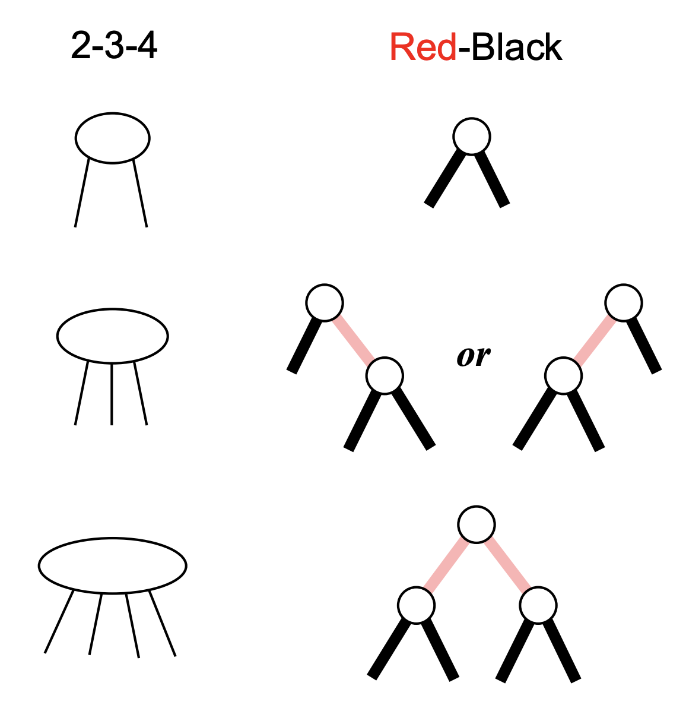

# Drzewa czerwono-czarne

Samoorganizujące się drzewo BST o właściwościach:

* Każdy węzeł jest czerwony albo czarny
* Korzeń jest czarny
* Liście są czarne
* Jeśli węzeł jest czerwony, to jego dzieci muszą być czarne
* Każda ścieżka z ustalonego węzła w dół do liści zawiera tyle samo czarnych węzłów.

Wymagania te gwarantują, że najdłuższa ścieżka od korzenia do liścia będzie co najwyżej dwukrotnie dłuższa, niż najkrótsza.

Dla n węzłów głębokość drzewa czerwono-czarnego wyniesie najwyżej 2 log (n+1).

### Insert

Umieszczamy element standardowo dla BST, kolorujemy go na czerwono i przywracamy własności czerwono-czarne.

Niech z – wierzchołek, który wstawiliśmy. Zakończymy poprawianie, kiedy rodzic z będzie czarny.

Załóżmy, że rodzic z jest lewym dzieckiem (gdy jest prawym, przypadki będą symetryczne). Możliwe są następujące sytuacje:

1. brat rodzica z jest czerwony

   ```python
   z.parent.color = black 
   z.parent.parent.right.color = black  # kolorujemy prawego brata rodzica na czarno
   z = z.parent.parent  # przenosimy się dwa poziomy do góry do dziadka z
   z.color = red
   ```

2. brat rodzica z jest czarny, a z jest prawym dzieckiem
   Przypadek 2. sprowadzamy do przypadku 3.

   ```python
   z = z.parent;     # przesuwamy się na ojca
   single_rotation(z) # wykonujemy rotację
   ```

3. brat rodzica z jest czarny, a z jest lewym dzieckiem

```python
z.parent.color = black     
z.parent.parent.color = red
single_rotate(z.parent.parent)
```

### Zamiana drzew czerwono-czarnych na 2-3-4 drzewa




